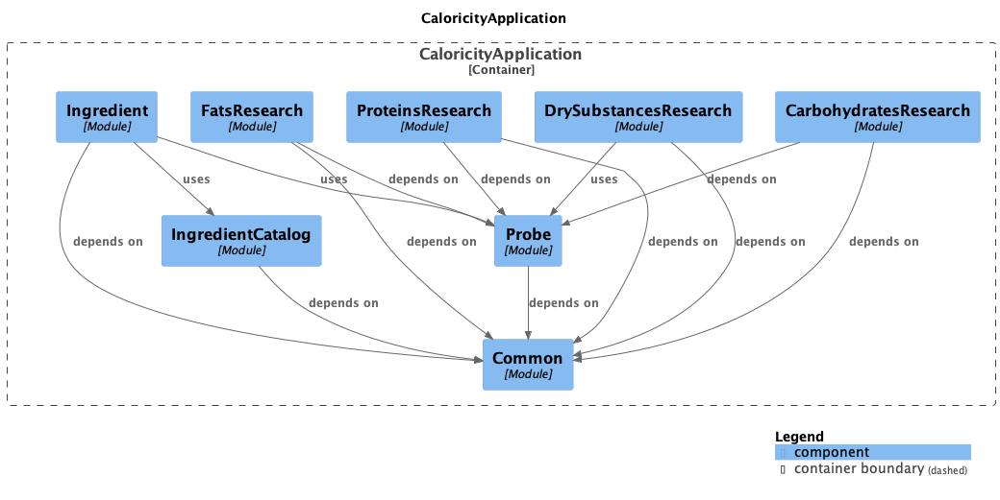

# caloricity_backend

Расчёт калорийности по "МЕТОДИЧЕСКИЕ УКАЗАНИЯ ПО ГИГИЕНИЧЕСКОМУ КОНТРОЛЮ ЗА ПИТАНИЕМ В ОРГАНИЗОВАННЫХ КОЛЛЕКТИВАХ (УТВ. МИНЗДРАВОМ СССР 29.12.1986 N 4237-86)
Источник: (1С-Рарус): https://otr-soft.ru/org/zakony_pitanie/mu_4237-86/"

## Components diagram



## Docker compose

```bash
docker compose -f ./docker-compose.dev.yml -p caloricity up -d
```

## Test database

```sql
CREATE DATABASE caloricity_test WITH OWNER caloricity ENCODING 'UTF-8' TEMPLATE template0;
```
